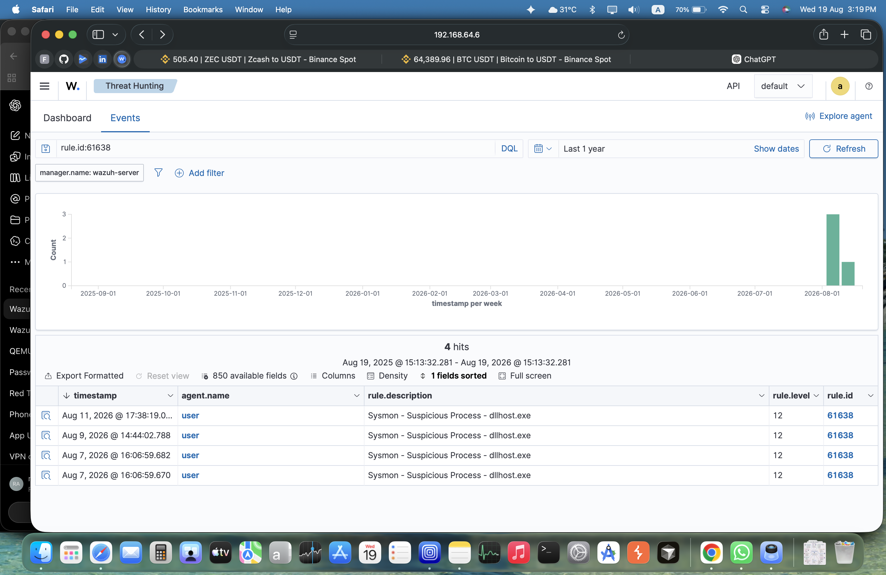
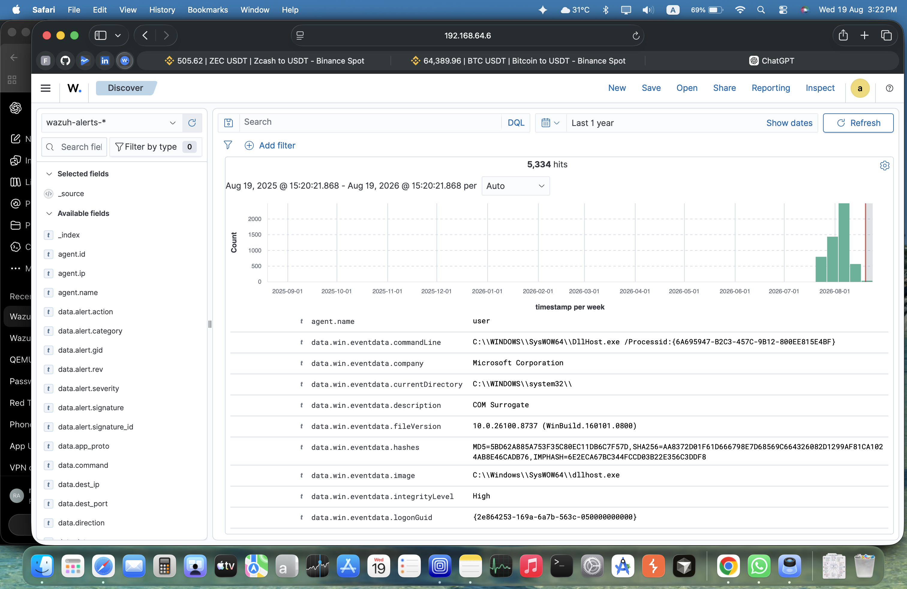

# Windows Sysmon - Suspicious dllhost.exe Investigation

## 1. Alert Summary

- SIEM: Wazuh
- Endpoint: Windows
- Detection: Sysmon - Suspicious Process - dllhost.exe
- Wazuh Rule ID: 61638
- Severity: Level 12
- Sysmon Event: Event ID 1 - Process Creation
- MITRE ATT&CK: T1055 - Process Injection

## 2. Initial Hypothesis

The alert was generated because a `dllhost.exe` process was created.

The initial hypothesis was that the process required investigation because
`dllhost.exe` can be associated with legitimate Windows COM activity but
can also be abused by attackers.

The alert alone was not considered sufficient evidence to classify the
process as malware.

## 3. Process Evidence

Observed executable:

C:\Windows\SysWOW64\dllhost.exe

Process:

dllhost.exe

Description:

COM Surrogate

Company:

Microsoft Corporation

User:

WIN-VTU7D3FFVFH\user

Integrity Level:

High

## 4. Process Investigation

Process ID:

11184

Parent Process ID:

744

Command Line:

C:\WINDOWS\SysWOW64\DllHost.exe /Processid:{6A695947-B2C3-457C-9B12-800EE815E4BF}

The parent PID was investigated separately and identified as:

svchost.exe

Parent command line:

C:\WINDOWS\system32\svchost.exe -k DcomLaunch -p

## 5. File Hash

SHA256:

AA8372D01F61D666798E7D68569C664326082D1299AF81CA1024AB8E46CADB76

The executable path, publisher information and hash were reviewed as part
of the investigation.

## 6. COM Investigation

The DllHost command line contained the COM GUID:

{6A695947-B2C3-457C-9B12-800EE815E4BF}

The GUID was investigated through the Windows Registry.

The investigation identified the associated CLSID:

{B75937F1-6F3A-411F-9A13-0A19E25DF414}

Description:

Out of process context menu host

Associated DLL:

C:\Windows\System32\OOPContextMenuHost.dll

## 7. Analysis

The alert was investigated using:

- Process information
- Parent process information
- Command-line analysis
- Executable path
- File hash
- User context
- Integrity level
- COM GUID
- Windows Registry information
- MITRE ATT&CK mapping

The Wazuh rule identifies `dllhost.exe` as suspicious, but the rule itself
does not prove that process injection occurred.

## 8. Verdict

The available evidence was not sufficient to classify the executable itself
as malware.

The executable was located in a standard Windows system directory and was
identified as a Microsoft Windows component.

The detection should therefore be treated as a suspicious behavior requiring
investigation rather than automatically classified as a confirmed malware
incident.

## 9. SOC Analyst Lesson

This investigation demonstrates that a SIEM alert is an investigation
starting point, not automatically a confirmed compromise.

The analyst should correlate process creation, parent process,
command-line arguments, file information, hashes, persistence,
network activity and other available telemetry before reaching a final
verdict.

## Evidence

### Wazuh Alert

The following screenshot shows the Wazuh alert generated by rule 61638.

### Event Details

The event contains the process creation telemetry collected through Sysmon, including the executable path, command line, process information, integrity level, file hashes, and COM-related information.

